<picture>

<source media="(prefers-color-scheme: dark)"
srcset="assets/dark.svg">

<source media="(prefers-color-scheme: light)"
srcset="assets/light.svg">

</picture>

# 👋 Hi, I'm Dushyant Sharma

### AI Engineer • MERN Stack Developer • Machine Learning Enthusiast

🎓 **B.Tech Electronics & Communication Engineering** • NIT Delhi

💡 Passionate about building AI-powered applications that solve real-world problems.

---

## 🚀 About Me

- 🔭 Currently building **AI + MERN Stack Applications**
- 🤖 Exploring **Large Language Models, RAG & AI Agents**
- 🌱 Learning **FastAPI, LangChain, Docker & Production AI**
- 💻 Practicing **Data Structures & Algorithms**
- 🎯 Goal: **Software Development Engineer & AI Engineer**
- 🌍 Interested in **Machine Learning, Generative AI & Process Mining**

 

---

# 💻 Tech Stack

---

# 🚀 Featured Projects

<table>
<tr>

<td width="50%" valign="top">

## 🌱 GreenTravel AI

AI-powered platform that predicts carbon emissions for business travel and provides sustainable travel recommendations.

**Tech Stack**

- Python
- Flask
- Scikit-Learn
- Pandas
- Machine Learning

</td>

<td width="50%" valign="top">

## 🌍 Celonis Sustainability Dashboard

Interactive Process Mining dashboard for analysing business travel emissions and supporting Net Zero 2030 sustainability initiatives.

**Tech Stack**

- Celonis
- PQL
- Process Mining
- Analytics
- Business Intelligence

</td>

</tr>
</table>

---

# 📊 GitHub Analytics

---

# 🏆 Social Profiles

---

# 📈 Activity Graph

---

# 🎯 Goals

- 🚀 Crack a top SDE / AI Internship
- 🤖 Build production-ready AI applications
- 🧠 Master Deep Learning, LLMs & AI Agents
- 🌐 Become a strong AI + Full Stack Developer
- 💯 Solve 500+ LeetCode problems

---

# 📫 Connect With Me

---

### ⭐ Thanks for visiting my profile!

